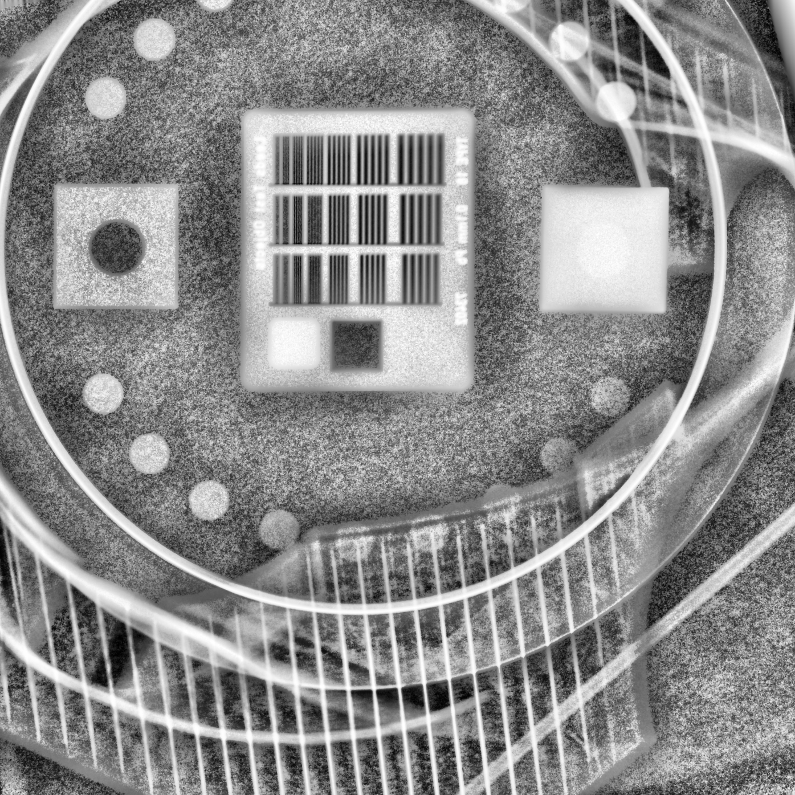
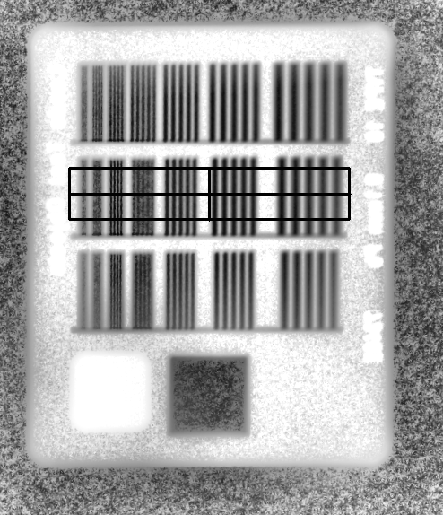
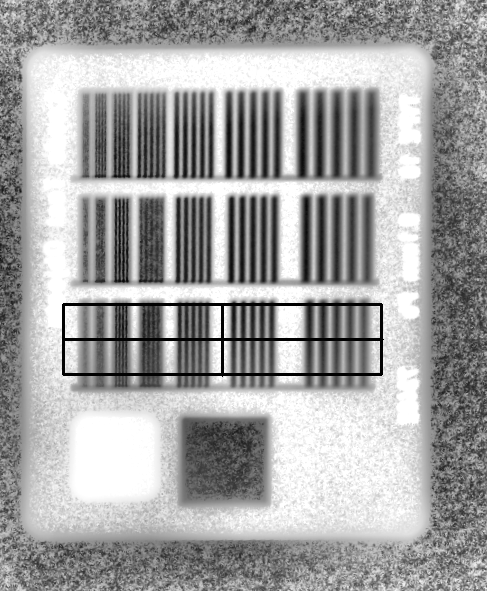
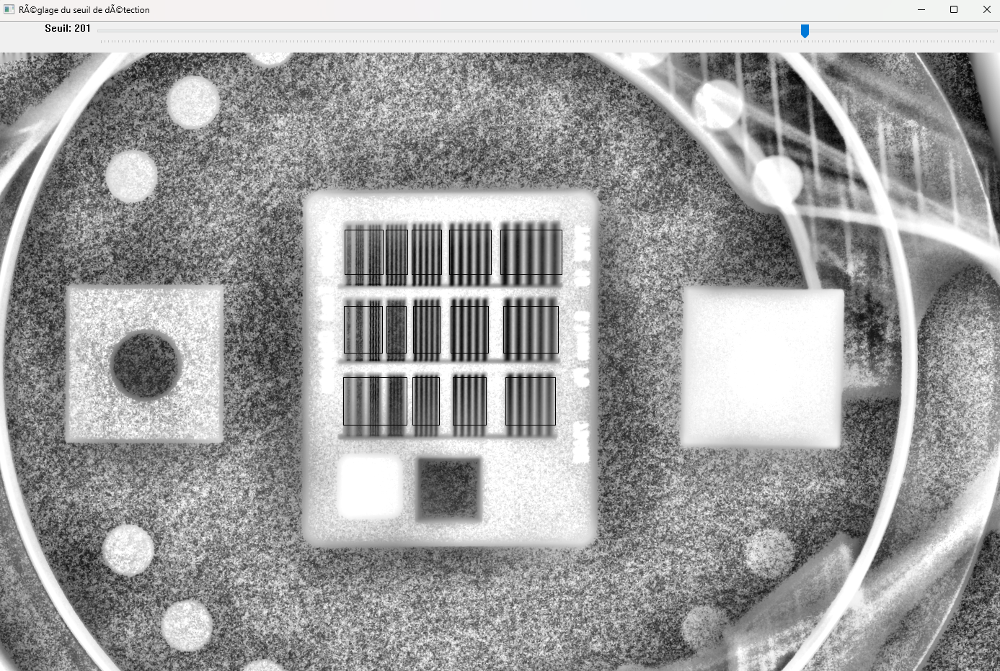
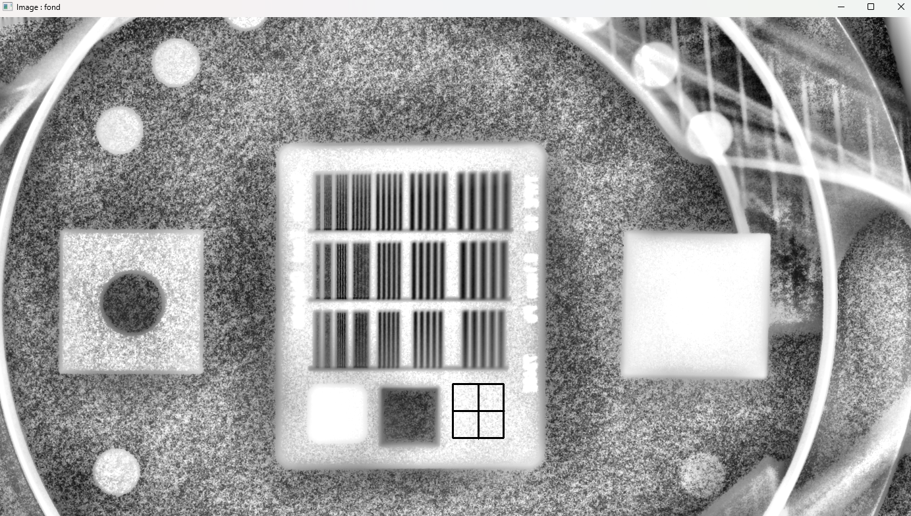
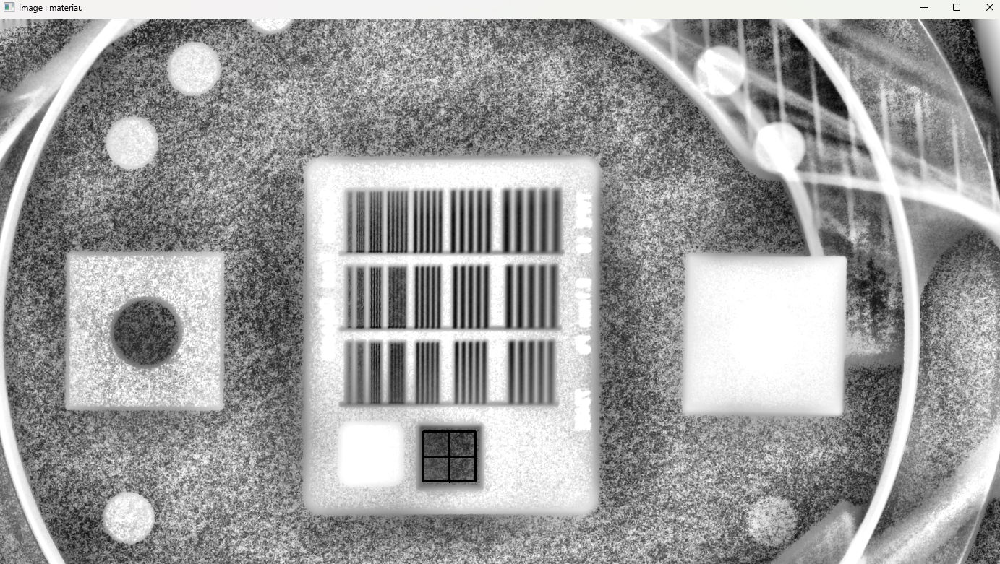
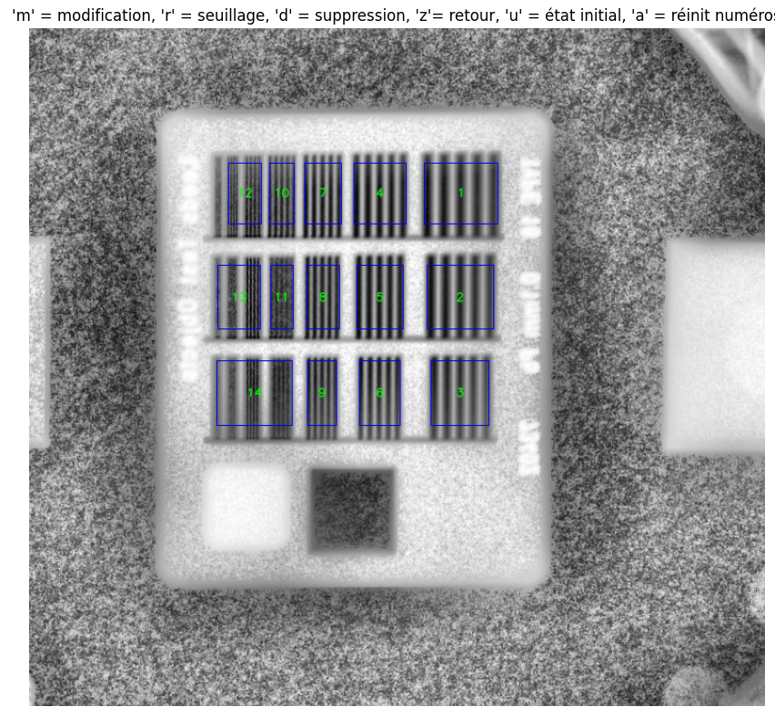

# MTF_TOR18 : Contrôle Qualité en Radiothérapie Conforme à l’ANSM 2023

Ce projet a été développé dans le cadre de la mise en conformité avec la décision de l’ANSM du 28 février 2023, fixant les modalités du contrôle de qualité des installations de radiothérapie externe et de radiochirurgie.

Le script MTF_TOR18.py permet notamment l’analyse de la Fonction de Transfert de Modulation (FTM), conformément aux exigences réglementaires en vigueur.

Il s'agit d’un projet à visée non commerciale, destiné à des usages scientifiques, pédagogiques ou institutionnels.
Toute utilisation à des fins lucratives va à l’encontre des objectifs initiaux et de l’esprit de recherche du projet.

## 📂 Contenu

 - 'MTF_TOR18.py' : Script de détection des groupes de barres sur le fantôme TOR18
 - 'README.md' : Explication du projet
 - '.gitignore' : fichiers ignorés par Git

 ## ▶️ Exécution
Ce projet a été développé avec la version 3.11.0 de Python (installer cette version pour travailler sur le code).
Vous pouvez soit installer l'excécutable, soit modifier le code source 😉

## Installation de l'excécutable
L'excécutable se situe dans le dossier dist.

## Modification du code source
Avant de commencer, initialiser votre environnement sur VSCode :
- Création de votre environnement  : python -m venv FTM_env
- Activation de votre environnement : FTM_env\Scripts\activate

Installer les dépendances : 
- pip install -r requirements.txt

Lancer le script avec :
- python script.py

⚡ Info rapide !
Ce script fonctionne uniquement avec des PNG pour le moment.
Les groupes de barres doivent être alignés comme sur ces images — des barres bien droites et propres ! (Un petit coup de retouche sur un éditeur d’images, et c’est réglé 😉)

Comment ça marche ?

1️⃣ Place correctement ton image modifiée, puis lance le script et sélectionne cette image.
2️⃣ Sélectionne les 3 lignes de groupes de barres : pour chaque ligne, appuie sur Entrée quand ta ROI est bien positionnée (voir exemples ci-dessous).

3️⃣ Une fois les 3 régions validées, appuie sur Échap.
4️⃣ Une fenêtre s’ouvre pour choisir le seuil de détection (à la louche). Valide avec Entrée.

5️⃣ Sélectionne ensuite le fond puis le matériau (images à l’appui).

Et après ?
- Pour changer le seuil, appuie sur ‘r’ et sélectionne la ROI à reseuiller.
- Pour modifier un numéro, appuie sur ‘m’, clique sur la ROI, et saisis le nouveau numéro dans le prompt.
- Tu peux aussi supprimer une ROI, revenir en arrière avec ‘z’, ou revenir à l’état initial avec ‘u’.
- La touche ‘a’ réinitialise tous les numéros.
- Quand tu as fini, ferme la fenêtre en cliquant sur la croix.

Résultat final
Le script génère une image finale binarisée avec la méthode d’Otsu, qui capture l’info utile dans chaque ROI.
Une figure s’affiche avec :
- La FTM mesurée dans chaque groupe,
- Un ajustement exponentiel pour analyser les données.

Deux fichiers seront sauvegardés :
- La figure affichée,
- Un fichier Excel avec toutes les valeurs calculées.

Have Fun et bon boulot ! 🎉
Pour toute question, n’hésite pas à me contacter sur LinkedIn ou par mail : motchy.saleh@chr-metz-thionville.fr
Tu peux aussi joindre M. DJIBOSIDIKOU pour un coup de pouce.

Motchy SALEH