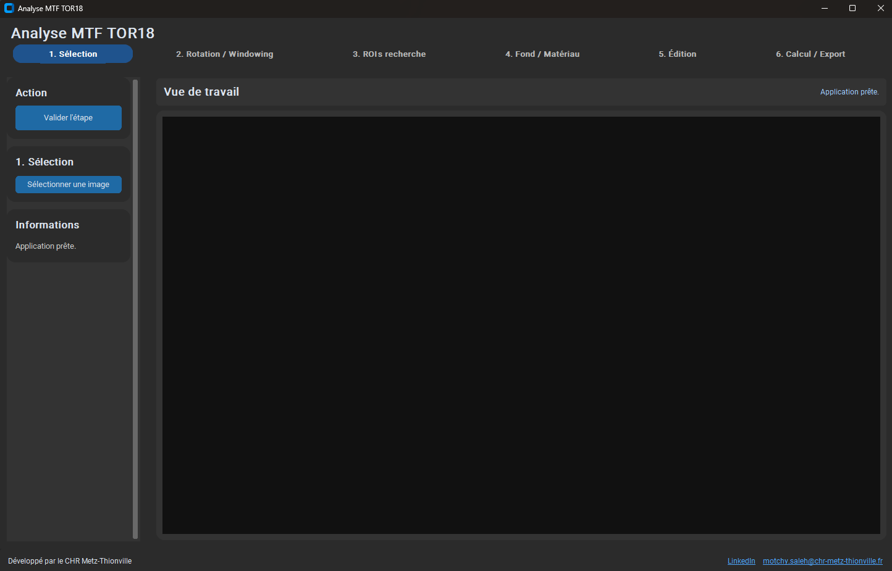
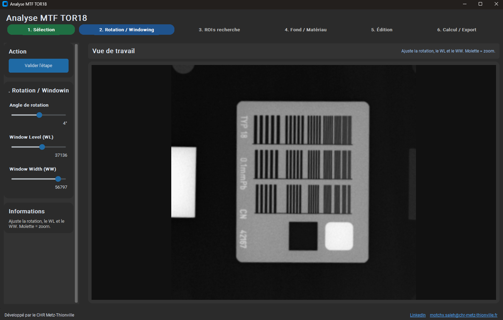
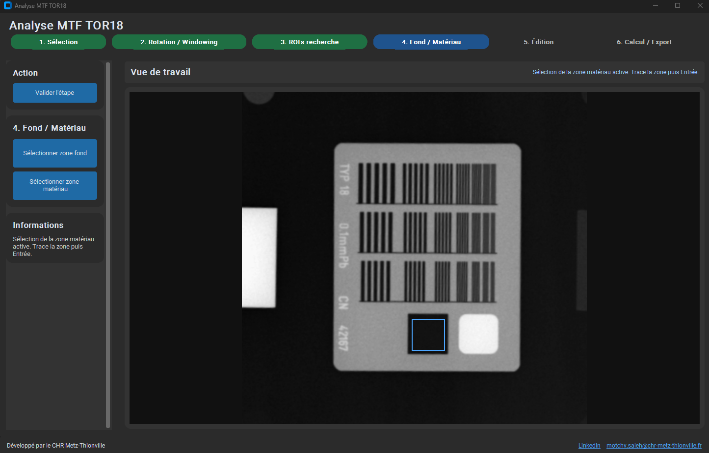
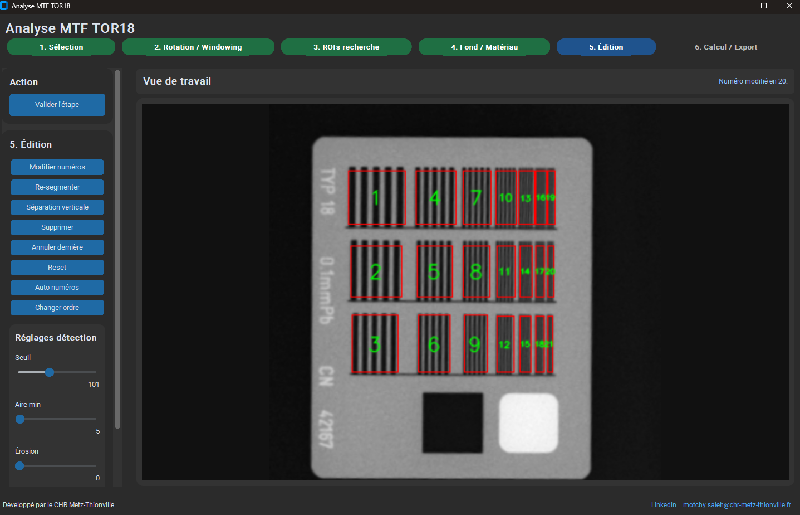
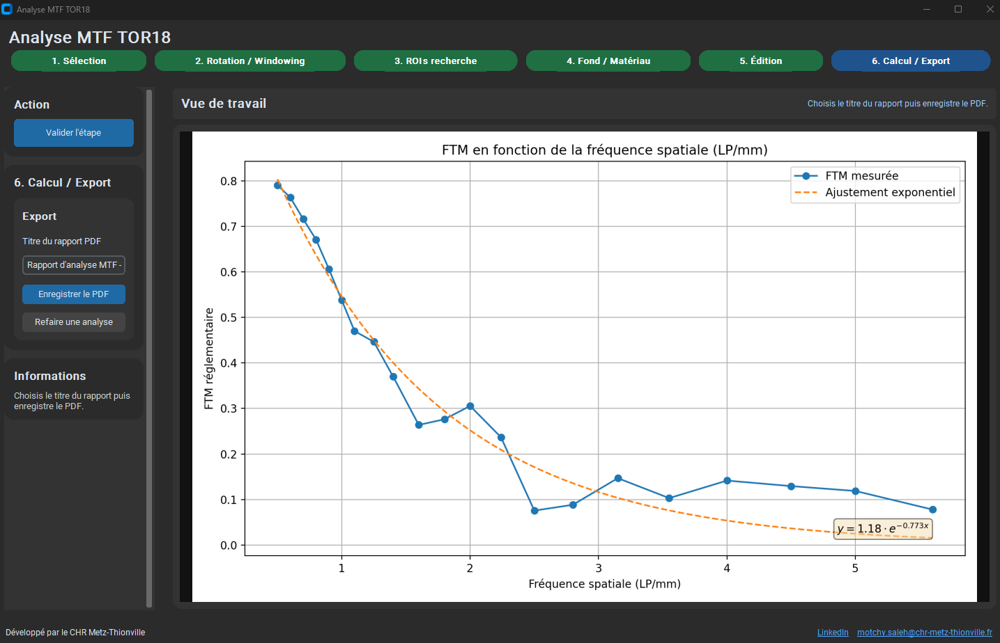

# MTF_TOR18 — Analyse FTM (Contrôle Qualité Radiothérapie)

Application permettant l’analyse de la **Fonction de Transfert de Modulation (FTM)** à partir d’images du fantôme **TOR18**, dans le cadre du contrôle qualité en radiothérapie conformément à la décision **ANSM du 28 février 2023**.

Màj : La 1ere version de l'application est disponible, si vous rencontrez des bugs, n'hésitez pas à me contacter.

---

## Téléchargement

Téléchargez l’exécutable :

➡️ **Lancer directement `MTF_TOR18.exe` (aucune installation requise)**

---

## Fonctionnalités

L’application permet :

- Chargement d’images **DICOM** ou standards (PNG, JPG, etc.)
- Rotation et réglage du contraste (WL / WW)
- Sélection des **ROIs de recherche**
- Sélection des zones **fond** et **matériau**
- Détection automatique des groupes de barres
- Correction manuelle :
  - modification des numéros
  - re-segmentation
  - suppression / séparation
- Calcul de la **FTM**
- Ajustement exponentiel
- Extraction :
  - **FTM 50 %**
  - **FTM 10 %**
- Export automatique :
  - image annotée
  - courbe FTM
  - fichier Excel
  - rapport PDF

---

## Formats supportés

- DICOM (`.dcm`, `.dicom`)
- Images (`.png`, `.jpg`, `.jpeg`, `.bmp`, `.tif`, `.tiff`, `.webp`)

---

## Utilisation

### 1. Charger une image
Lancer l’application puis sélectionner l’image à analyser.

---

### 2. Ajuster l’image
- Rotation
- Window Level (WL)
- Window Width (WW)

👉 Important : les barres doivent être **droites et bien visibles**

---

### 3. Sélectionner les ROIs
Sélectionner les zones contenant les groupes de barres.

---

### 4. Sélectionner les références
- Zone **fond**
- Zone **matériau**

---

### 5. Ajuster si nécessaire
L’application permet de corriger automatiquement ou manuellement :

- modifier les numéros
- re-segmenter une zone
- supprimer une ROI
- revenir en arrière
- renuméroter automatiquement

---

### 6. Résultats

L’application génère automatiquement :

- une image annotée
- une courbe FTM
- un fichier Excel
- un rapport PDF

---

## Recommandations

- Image bien orientée
- Bon contraste
- ROIs correctement positionnées

---

## Contact

**Motchy SALEH**  
📧 motchy.saleh@chr-metz-thionville.fr  
🔗 https://www.linkedin.com/in/motchy-saleh/

---

## Usage

Projet à visée **non commerciale**  
Utilisation recommandée dans un cadre **scientifique, hospitalier ou pédagogique**

---

Bon usage 👌